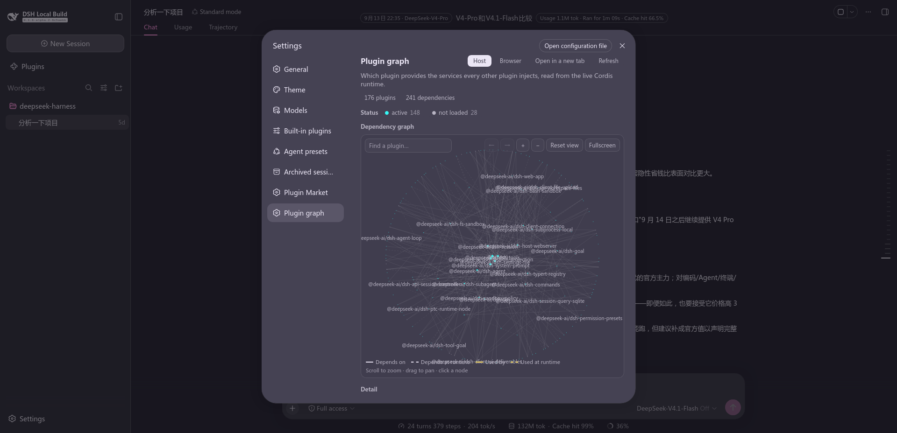
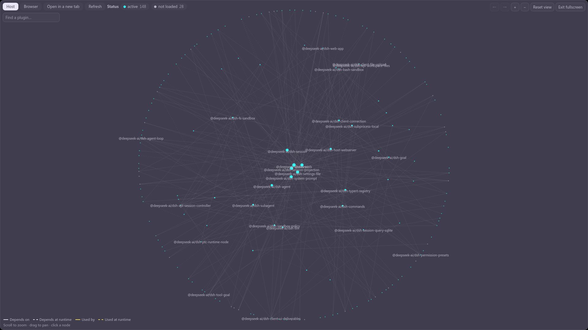
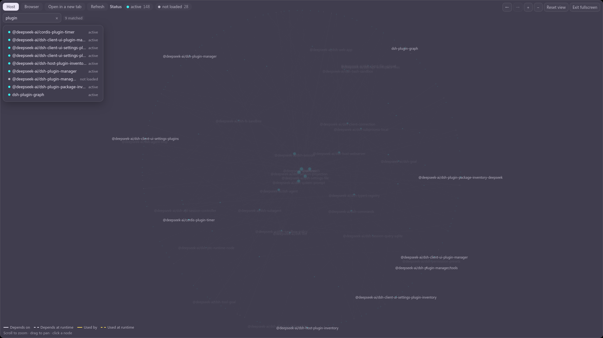
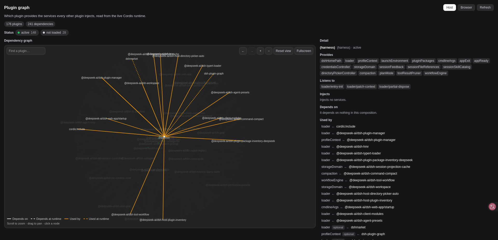

English | [中文](README.zh.md)

# Plugin graph

Which plugin provides the services every other plugin injects — read from the live Cordis
runtime, not from a manifest.

A settings section draws the graph, and a standalone page shows the same graph at full width.
Both render the *same* panel: the two hosts differ only in what they can supply (a locale
service, a theme, a window instead of a settings column).

## Screenshots

The section, as it opens: the counts, the **status row** (a dot per state the graph has, its
count, and a click that filters to it), the drawing, and the **four-line key** in the corner.
The controls above the drawing are `← →` (selection history), zoom, reset and fullscreen.



Fullscreen. The canvas IS the fullscreen element, so everything the panel put beside it is off
screen — which is why the toolbar moves to the top line inside the canvas and the search box
takes the second.



A selected node. Its own description appears under the name, **Listens to** says which events it
subscribes to, and the wires split by direction — **the key in the corner names which colour is
which** — dashed where the dependency is only acquired at runtime.


Searching. The matches are listed as a card, each row carrying the package and its state, and the
drawing dims everything else. The `×` in the field clears it and hands the caret back.



The standalone viewer, opened in a new tab: the same graph at the width of a whole window. Here it
has the **`(harness)`** node selected — the runtime's own row, which carries everything no plugin
claims: the services the root fiber provides, the services it injects, and the events it listens
to. It depends on nothing, so it has incoming wires only.



## The two trees

There are two Cordis runtimes, and they get two graphs:

| | Host | Browser |
|---|---|---|
| Where it runs | the Node process | the page |
| Collected by | `collectGraph(ctx)` on the host | `collectGraph(ctx.root)` in the page |
| Shown by | this section, fetched over HTTP | reported by the page, read back by the viewer |

**They are never merged.** They are different runtimes with different plugins and different
service names, so a merged graph would not be a bigger one — it would be a wrong one. The
Browser tab is a second *source*, not a second set of nodes.

The browser tree cannot be collected by the Node half, so the page is the only thing that can
describe it: the section POSTs what it collected to `/dsh-plugin-graph/client`, and the viewer
GETs it back (one path, two methods). The report carries **the instant it was taken**, and the
viewer prints it — a graph a reader believes is current but is not is worse than one that admits
its age.

The browser tree's **descriptions** come from a route of their own
(`/dsh-plugin-graph/descriptions`), because the page cannot read `node_modules` while the packages
it is describing are the same ones: this half reads them and serves a name → description table.
That read is the one place the two halves differ in capability, and it is why the merge lives in
`src/describe.ts` — pure, so both halves run one implementation, while only the Node half touches
`node:fs`. Resolution tries the plugin's own tree first, then bases learned from the host's
`profileContext.dir`: measured, the obvious bases all land on the checkout, where none of the
third-party plugins are installed.

## How a dependency is acquired

A plugin can take a service two ways, and the difference is not cosmetic:

- **Declared** on the plugin (`export const inject = [...]`, an `inject:` option, or the
  `@Inject` decorator) — the fiber stays pending until every one of them resolves. The plugin
  does not load without them.
- **At runtime**, through the `ctx.inject(deps, callback)` helper — the callback runs once they
  appear. The plugin loads either way; only that contribution waits.

Both are real dependencies, both get edges, and the second is what the `optional` mark means. A
missing *required* service is a broken composition; a missing *optional* one is the ordinary
case the callback form exists for.

The collection reads three things, and the distinction matters: the **Loader entries** give the
ids and package names, the **reflection store** is the authoritative provider table (keyed by
isolation symbol — the fiber's own `store` is the wrong source and would name consumers as
providers), and the **registry** supplies every live fiber, including ones started at runtime.

## Reading the graph

- **The layout is data, not physics.** A node sits closer to the middle the more plugins depend on
  it, and the angle is a golden-angle walk over the ids — so the same composition draws the same
  picture on every visit, and a refresh never makes the reader find their bearings again. Hubs are
  the centre; the rim is what nothing depends on.
- **Refresh** re-reads the graph. It keeps whatever is on screen while it does, rather than
  blanking to a spinner: the canvas can be the fullscreen element, and an element that leaves the
  document takes fullscreen with it.
- **Search** filters by name as you type, and the matches are listed as a card with each
  package's state beside it — the list is also the way to reach a node that the filter has dimmed
  off to the edge. The `×` in the field clears the query and returns the caret to it; the field
  keeps the room for that button whether or not it is showing, so nothing shifts as you type.
- **The status row** is a legend, a census and a filter at once: one pill per state the graph
  actually has, its count, and a click that narrows the drawing to that state. It lists only the
  states present — a row of mostly-zero pills would read as legend for colours nobody can see. The
  key is always shown; the swatches keep the selected colours whether or not anything is selected,
  because a reader who has not clicked yet is the one who needs to know what the colours mean.
- **Scroll** zooms, **drag** pans, a **click** selects. A scroll inside the match card or the
  detail card scrolls THAT card: they are panels over the drawing, and reaching for them means
  scrolling a list, not zooming what is behind it.
- **Back and forward** walk the trail of selected nodes. Choosing a new node after going back
  drops the forward entries — the same rule a browser applies, for the same reason — and "nothing
  selected" is a step like any other, so a node can be reached again from either side.
- **Fullscreen** fills the window. The toolbar and the search box move INSIDE the canvas, on the
  first two lines, and the detail follows onto it as an overlay: the column beside the drawing is
  not on screen in that mode.
- **Open in a new tab** hands the graph to the standalone viewer — a whole page, served by the
  Node half, which is the point: an iframe or a route inside the app would inherit the same
  width the reader is trying to get away from.
- **Open configuration file** jumps to this plugin's row in the settings editor.

## What a node reports

Selecting a node fills the detail card with everything the runtime knows about that plugin:

- **The package's own description**, read from its `package.json`. Absent rather than empty when
  the package does not say, or when nothing could read it — drawing no line is the truthful
  rendering of "this package does not describe itself".
- **Provides** — the services its fibers registered.
- **Listens to** — the event names its fibers subscribed to, read from the dispatcher's own table.
  **One direction only**, and named for it: dispatch never records a publisher, so who *emits* a
  name is not knowable. Listeners produce no edges either — a listener waits for a name, not for a
  provider, so it is not a dependency, and drawing it as an edge would be a false one.
- **Injects** and **Injected at runtime** — the two ways a dependency is acquired, listed apart
  because they answer different questions; a plugin asking "why did this not load" wants the first.
- **Depends on** and **Used by** — every edge in both directions, each row naming the service that
  makes it and whether it is optional.

**`(harness)`** is the one node that is not a plugin: it is the runtime's own row. Services
provided by a fiber with no Loader entry behind it — the root fiber, and anything started outside
the entry tree — are credited here rather than dropped, and their injections and listeners come
with them. It is what keeps `loader` and the environment rows from reading as unresolved
dependencies of everything that injects them.

## What the graph reports

Two blocks sit under the drawing, and both are about work rather than about drawing:

- **Unresolved dependencies** — required services with no provider anywhere in this composition.
  Only *required* ones: an optional injection with no provider has simply not been offered yet,
  and the plugin is working as designed.
- **Isolated services** — one service name with more than one live implementation, i.e. provided
  under more than one isolation label.

## The standalone viewer

A page the Node half serves as a whole document. It has no Cordis of its own, so it can only
show the host's tree plus the browser report the app sent — and it reads two things from the URL
it was opened with, because it cannot read them any other way:

| Parameter | Why |
|---|---|
| `?scheme=dark\|light` | the page styles itself with the app's `--dsw-*` tokens; the attribute that switches them is the app's, not this page's |
| `?lang=zh\|en\|ja\|ko\|es\|fr\|de` | so the new tab opens in the language the app is **in**, instead of guessing from the browser |

The locale is whitelisted against the dictionaries before it reaches the document — a query
string is not a place to trust, and that value ends up in the page's `lang` attribute. A page
opened directly (no parameter) falls back to the browser's own preferences, then to English.

The browser report lives in memory only, never on disk: it describes a runtime that exists while
the page is open, and a report that outlived a host restart would be describing something that
is not there.

## Language

Seven dictionaries in `src/client/locales.ts`: `zh` and `en` (the two the shell carries) plus
`ja`, `ko`, `es`, `fr` and `de`, contributed one namespace at a time through the single-locale
overload — the language pack a profile carries owns the *definition* that makes a language
selectable, and this plugin adds only its own strings to it. It deliberately does not call
`addLanguage`.

Every dictionary is typed `Record<MessagesKey, string>`, so a key added to `MessagesKey` fails to
compile until all seven carry it. Wording follows `session-messages`, which shipped these five
first: the plugins sit in one interface, so a reader must meet the same terms in both.

## Layout

```text
plugin-graph-plugin/
  package.json        dsh.bundle + dsh.client declarations, exports map (private, not published)
  cordis.patch.yml    layer patch: the Loader row
  build.mjs           build script: bundles both halves, and copies the theme at build time
  tsconfig.json       IDE type resolution only, pointing at the checkout source (read-only)
  src/
    index.ts                 Node half: collectGraph, and the routes below
    graph-types.ts           the wire shape both halves share (types + path constants)
    collect.ts               the collector, one function for both runtimes
    describe.ts              the description merge, pure — both halves run it, only the
                             Node half reads package.json
    viewer-page.ts           the standalone page's document, as a string
    viewer/main.tsx          the standalone page's body (React bundled in — that page has no
                             module table to answer a bare `react` import)
    client/
      index.ts               registers the settings section
      GraphPanel.tsx         the panel both hosts render
      graph-canvas.tsx       the drawing: layout, hit testing, zoom/pan
      locales.ts             the seven dictionaries
  docs/                      the screenshots above (chinese variants: `-zh.png`)
```

Routes, all under `/dsh-plugin-graph`: the graph itself, `/view` (the page), `/viewer.js`, and
`/theme.css` — plus `/client`, which takes a POST from the app and answers a GET for the viewer,
and `/descriptions`, which serves the name → description table for the browser tree.

## Development

```sh
npm run build     # bundles lib/index.js, lib/client.js and lib/viewer.js
npx tsc -p tsconfig.json   # type check
```

Install as a plugin in a DSH checkout by adding this directory's `cordis.patch.yml` to the
bundle: it inserts the single Loader row. Nothing here needs the host's source to be modified —
that is a constraint this plugin is built to, not a coincidence.
