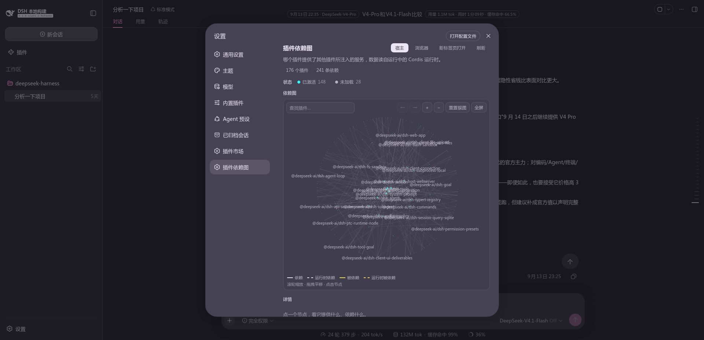
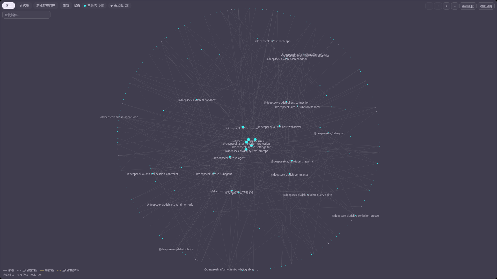
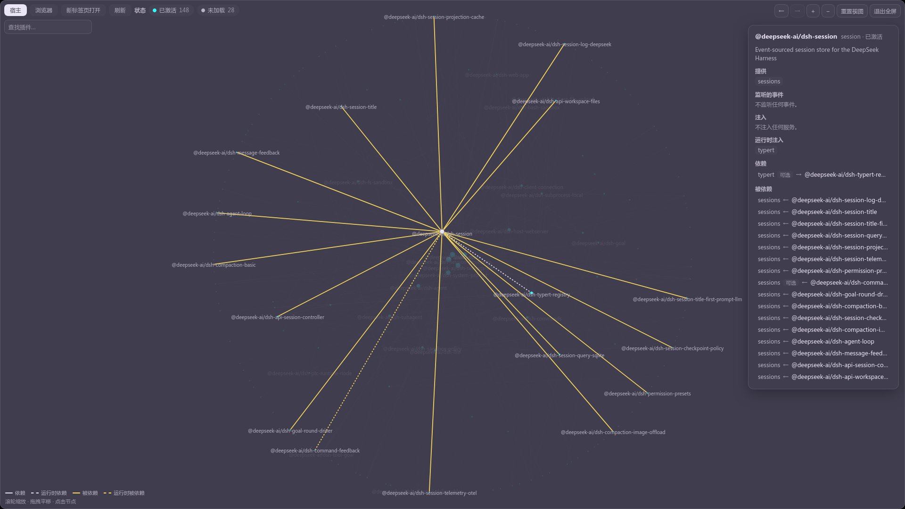
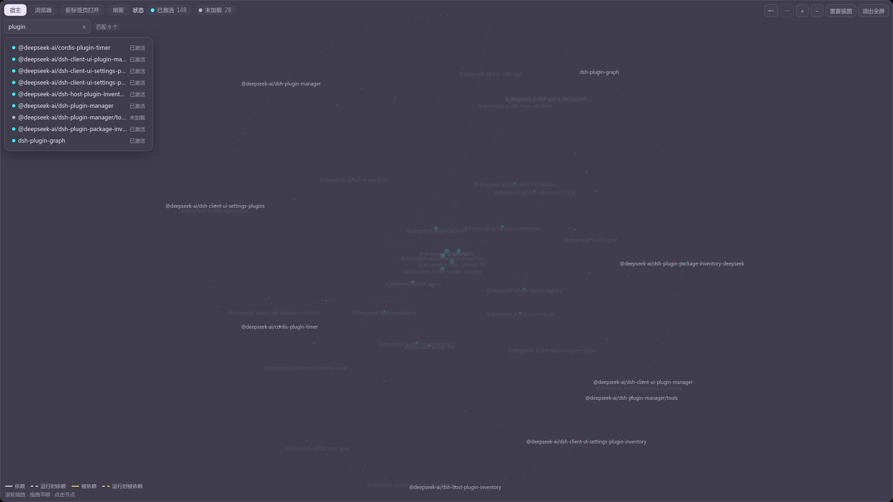
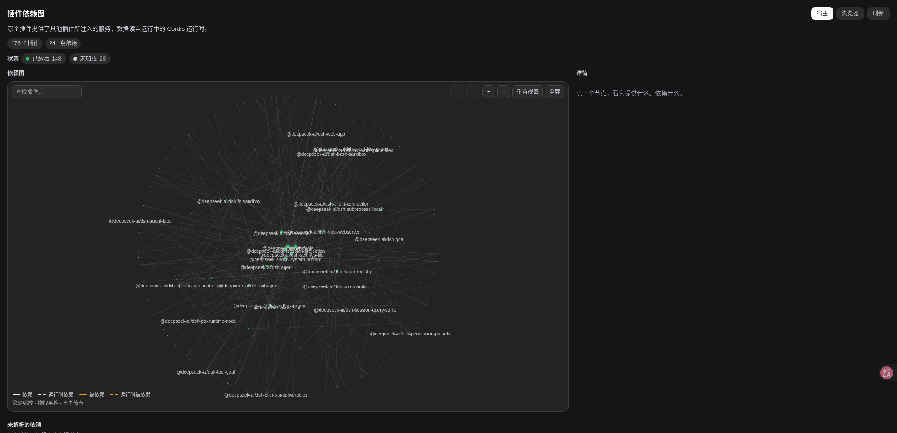

[English](README.md) | 中文

# 插件依赖图

哪个插件提供了其他插件所注入的服务——读自**运行中的 Cordis 运行时**，而不是某份清单。

设置里有一个分节绘制这张图，另有一个独立页面以整页宽度展示同一张图。两处渲染的是**同一个面板**：
两个宿主只在"能提供什么"上不同（一个 locale 服务、一套主题、一个小窗口 vs 一整个页面）。

## 截图

分节刚打开的样子：统计胶囊、**状态行**（图上真有的每个状态一颗色点、它的数量，点一下即筛选到它）、
画面，以及角落里那段**四行图例**。画面上方的控件依次是 `← →`（选中历史）、缩放、重置视图、全屏。



全屏。**画布本身就是全屏元素**，所以面板里放在它旁边的东西在屏幕上都不存在——这正是
工具栏要移到画布内的第一行、搜索框占第二行的原因。



选中一个节点。包名下方是**它自己的描述**，**监听的事件**列出它订阅了哪些事件，
而连线按方向分开——**两个颜色各是哪一边，看图例**——只在运行时才取的依赖仍然是虚线。



搜索。命中的插件列成一张卡片，每行带着包名与它的状态，画面把其余部分变暗。
输入框里的 `×` 清空查询并把光标交回输入框。



新标签页里的独立查看页：同一张图，用整个窗口的宽度。这里选中的是 **`(harness)`** 节点——
**运行时自己那一行**，承载一切不归属任何插件的条目：根 fiber 提供的服务、它注入的服务、
以及它监听的事件。它不依赖任何插件，所以只有指向它的线。



## 两棵树

一共有两个 Cordis 运行时，因此有两张图：

| | 宿主 | 浏览器 |
|---|---|---|
| 在哪运行 | Node 进程 | 页面里 |
| 谁来采集 | 宿主侧的 `collectGraph(ctx)` | 页面里的 `collectGraph(ctx.root)` |
| 谁来展示 | 本分节，经 HTTP 取回 | 由页面上报，查看页再读回 |

**两者永不合并。** 它们是不同的运行时：插件不同、服务名也不同——合并出来的不是更大的图，
而是**错的图**。浏览器那一栏是第二个**来源**，不是第二组节点。

浏览器那棵树无法由 Node 半采集，所以只有页面能描述它：分节把它采集到的结果 POST 到
`/dsh-plugin-graph/client`，查看页再 GET 回来（一条路径、两个方法）。这份报告带着**采集时刻**，
查看页会把它显示出来——一张被读者当成"当前"、其实不是的图，比一张坦白自己几点了的图更糟。

浏览器树的**描述**来自它自己的一条路由（`/dsh-plugin-graph/descriptions`）：页面读不到 `node_modules`，
而它要描述的那些包正是同一批，所以由 Node 半读出并给出「包名 → 描述」的表。**这是两半能力唯一不同的
地方**，也是合并逻辑放在 `src/describe.ts` 的原因——它是纯的，两半跑同一份实现，而只有 Node 半碰
`node:fs`。解析顺序是：先试插件自己的目录，再试从宿主 `profileContext.dir` 学来的基点——实测下来，
那些"显而易见"的基点全都落在仓库里，而第三方插件一个都不在那儿。

## 依赖是怎么获得的

一个插件拿到服务有两种方式，区别不是修饰性的：

- **声明式**（插件上写 `export const inject = [...]`、`inject:` 选项，或 `@Inject` 装饰器）——
  fiber 会一直挂起，直到它们全部解析。**少了它，插件根本不会加载。**
- **运行时**，通过 `ctx.inject(deps, callback)` 助手——依赖出现后回调才跑。插件照常加载，
  **只有那一项贡献在等**。

两者都是真实依赖，都会产生边，而第二种就是 `optional` 标记的含义。缺一个**必需**服务是组合坏了；
缺一个**可选**服务是回调形式本来就为之存在的正常情形。

采集会读三处，而且这个区分很要紧：**Loader 条目**给出 id 与包名；**反射存储**是权威的提供者表
（按隔离符号索引——fiber 自己的 `store` 是错的来源，会把消费者当成提供者）；**注册表**给出所有
活着的 fiber，包括运行时才启动的那些。

## 怎么看这张图

- **布局是数据，不是物理。** 越多人依赖的插件越靠中心，角度是沿 id 走的黄金角——所以**同一份组合
  每次画出来都一样**，刷新不会让读者重新找方向。中心是枢纽，外圈是没人依赖的那些。
- **刷新**重新读取这张图，但**保留屏幕上已有的内容**而不是先清成转圈：画布可能就是全屏元素，
  而一个离开文档的元素会把全屏一起带走。
- **搜索**按名字即时过滤，命中项会列成一张卡片，每行带该插件的状态——**这张列表也是**够到那些
  被筛暗、缩到边上的节点的办法。输入框里的 `×` 清空查询并把光标交回；右内边距是**一直留着**的，
  所以敲字时框里的内容不会位移。
- **状态行**同时是三样东西：图例、计数、筛选。图上真有的每个状态一颗胶囊，点一下就把画面窄到
  那个状态。**只列图上确实存在的状态**——一排大多是 0 的胶囊，看起来像在给看不见的颜色作说明。
  图例则**始终显示**，而且线段用的就是"选中时"的颜色：**还没点过的那个读者，才最需要知道颜色的含义**。
- **滚轮**缩放，**拖拽**平移，**点击**选中。但在匹配卡片或详情卡片里滚动时，滚的是**那张卡片**——
  它们是浮在画面上的面板，把手伸过去是想翻一张列表，不是想缩放它背后的图。
- **后退 / 前进**沿选中轨迹走。后退之后再选一个新节点，会**丢弃前进历史**——与浏览器同一条规则、
  同一个理由；"未选中"也是一步，所以一个节点从两个方向都回得去。
- **全屏**铺满窗口。工具栏与搜索框会**移进画布内部**、占前两行，详情作为浮层跟进去：
  那个位置的右侧栏在屏幕上并不存在。
- **新标签页打开**把这张图交给独立查看页——一个由 Node 半服务的整页。这正是重点：
  iframe 或应用内的路由都会继承读者正想摆脱的那个宽度。
- **打开配置文件**跳到设置编辑器里本插件对应的那一行。

## 一个节点上报什么

选中一个节点后，详情卡里是运行时知道的全部事实：

- **包自己的描述**，读自它的 `package.json`。包没写、或者读不到时**不显示这一行**而不是显示空白——
  "这个包没有自述"是事实，画一个空框则是我们的话。
- **提供**——它的那些 fiber 注册的服务。
- **监听的事件**——它的 fiber 订阅了哪些事件名，读自派发器自己的表。**只有这一个方向**，字段名也是
  照此取的：派发从不登记发布者，所以"谁**发出**这个名字"无从枚举。监听**也不产生边**——
  监听等的是一个**名字**，不是一个提供者，所以它不是依赖，画成边就是假边。
- **注入**与**运行时注入**——依赖的两种获取方式，分开列是因为它们回答不同的问题：
  一个在问"它为什么没加载"的读者，要的只是前者。
- **依赖**与**被依赖**——两个方向的每条边，每行给出造成这条边的服务名，以及它是否可选。

**`(harness)`** 是唯一不是插件的节点：它是**运行时自己那一行**。没有 Loader 条目归属的 fiber
（根 fiber，以及条目树之外启动的那些）提供的服务记在这里而不是丢掉，它们的注入与监听也一并记在
这里。`loader` 与环境那几行因此不会读成"所有注入者的未解析依赖"。

## 图上报了什么

画面下方有两块内容，两块都关乎"活儿"而不是"画法"：

- **未解析的依赖**——在本组合里没有任何提供者的**必需**服务。只列必需的：一个没有提供者的
  可选注入只是还没被提供而已，插件正按设计工作。
- **被隔离的服务**——同一个服务名有多个活实现，也就是在多个隔离标签下被提供。

## 独立查看页

一个由 Node 半作为完整文档服务的页面。它自己没有 Cordis，所以只能展示宿主的树，以及应用上报的
浏览器树。它从"被打开时的 URL"里读两样东西，因为除此之外它无从得知：

| 参数 | 为什么 |
|---|---|
| `?scheme=dark\|light` | 页面用应用的 `--dsw-*` 令牌来配色，而切换这些令牌的属性属于应用，不属于这个页面 |
| `?lang=zh\|en\|ja\|ko\|es\|fr\|de` | 让新标签页用应用**当前**的语言打开，而不是靠浏览器去猜 |

语言在进入文档之前会先过一遍字典白名单——查询串不是可以信任的地方，而这个值最终会写进页面的
`lang` 属性。直接打开该页（没有参数）时，依次回落到浏览器自身的语言偏好，再回落到英文。

浏览器那份报告只存在于内存里，从不落盘：它描述的是一个**只在页面开着时存在**的运行时，
而一份熬过了宿主重启的报告，描述的是个并不存在的东西。

## 语言

`src/client/locales.ts` 里提供七本字典：宿主自带的 `zh` 与 `en`，外加 `ja`、`ko`、`es`、`fr`、`de`。
后五种通过**单语言重载**逐个注册——环境所携带的语言包里那份**定义**才是让一种语言可被选中的东西，
本插件只往它上面补自己的字符串，且刻意**不调用 `addLanguage`**。

七本字典都标注为 `Record<MessagesKey, string>`：往 `MessagesKey` 加一个键，七本补齐之前**编译不过**。
用词与 `session-messages` 一致（那五本最早由它带上）——两个插件在同一套界面里，
读者应当两处看到同样的术语。

## 目录

```text
plugin-graph-plugin/
  package.json        dsh.bundle + dsh.client 声明、exports 映射（private，不对外发布）
  cordis.patch.yml    层补丁：插入 Loader 那一行
  build.mjs           构建脚本：打包两半，并在构建期复制主题
  tsconfig.json       仅用于 IDE 解析类型，指向检出源码（只读）
  src/
    index.ts                 Node 半：collectGraph，以及下面那几条路由
    graph-types.ts           两半共享的 wire 形状（类型 + 路径常量）
    collect.ts               采集器，两个运行时共用一个函数
    describe.ts              描述合并，纯函数——两半都跑它，只有 Node 半读 package.json
    viewer-page.ts           独立查看页的文档，以字符串形式给出
    viewer/main.tsx          独立查看页的主体（React 被打包进来——那个页面没有模块表
                             可以应答一个裸的 `react` 导入）
    client/
      index.ts               注册设置分节
      GraphPanel.tsx         两个宿主都渲染的面板
      graph-canvas.tsx       画面本身：布局、命中检测、缩放平移
      locales.ts             七本字典
  docs/                      上面那些截图（中文版为 `-zh.png`）
```

路由都在 `/dsh-plugin-graph` 之下：图本体、`/view`（页面）、`/viewer.js`、`/theme.css`，
`/client`——它接受应用发来的 POST，并应答查看页的 GET——以及 `/descriptions`，
它给浏览器树提供「包名 → 描述」的表。

## 开发

```sh
npm run build     # 打包 lib/index.js、lib/client.js、lib/viewer.js
npx tsc -p tsconfig.json   # 类型检查
```

在 DSH 检出里作为插件安装：把本目录的 `cordis.patch.yml` 加进 bundle 即可，它只插入一条 Loader 行。
这里**没有任何东西需要改动宿主源码**——这是本插件被构建出来时就遵循的约束，不是巧合。
